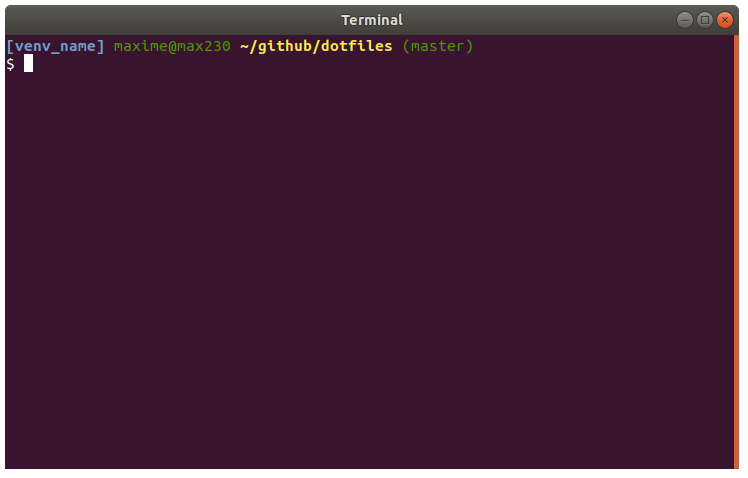

Dot Files
=======================

These are my dotfiles and common configurations I like to replicate across computers.

I mainly use Ubuntu and bash, nothing fancy here.

	

Installation
=============

All you do right now is run the install.sh script in the root directory.
